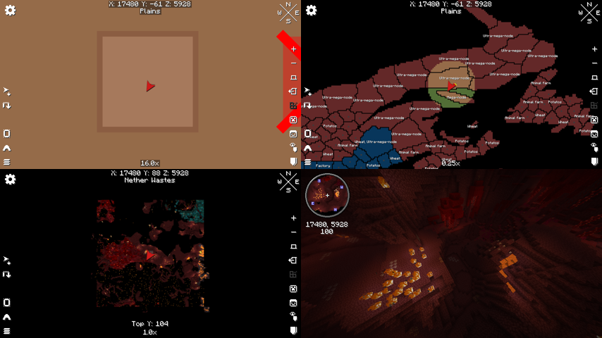
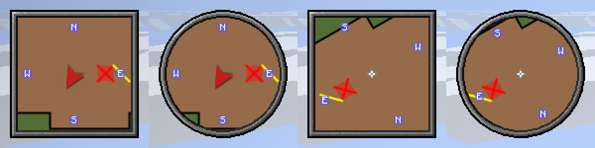

# Xaero render hooks

The Crusalis overlay draws straight into Xaero's World Map and Minimap, without XaeroPlus.
It needs Xaero's World Map, and Xaero's Minimap if you want the overlay on the minimap.
This page records where the hooks sit, how the transforms work and what to watch for when
Xaero updates.

Code:

- `AechronisRenderer`: builds the overlay on the client tick and draws it. It covers fills,
  lines and labels, plus the Overworld-only check.
- `client/mixin/AechronisWorldMapMixin`: world map geometry hook and label hook.
- `client/mixin/AechronisMinimapMixin`: minimap geometry hook.
- `client/mixin/AechronisMinimapLabelMixin`: minimap label hook.
- `DevAutoTest`: a dev-only self-test (see Test results).

There are two drawing passes per map:

1. **Geometry pass.** Nation fills, node borders and occupied diagonals are drawn into
   Xaero's map framebuffer, the same way
   the map tiles are. This means they zoom, rotate and get clipped exactly like the map.
2. **Label pass.** Labels are drawn after the map framebuffer has been composited to the
   screen. They stay upright on a rotating minimap and stay crisp at any world map zoom.

## Versions examined

These are the jars installed in Lunar profile `1.21.11-creative`:

| Mod | Jar | Mod id | Version |
|---|---|---|---|
| Xaero's Minimap | `xaerominimap-fabric-1.21.11-26.5.0.jar` | `xaerominimap` (regular edition, **not** Fair-Play `xaerominimapfair`) | 26.5.0 |
| Xaero's World Map | `xaeroworldmap-fabric-1.21.11-1.46.0.jar` | `xaeroworldmap` | 1.46.0 |
| XaeroLib (jar-in-jar of both) | `xaerolib-fabric-1.21.11-1.7.3` | `xaerolib` | 1.7.3 |
| XaeroPlus (reference only) | `XaeroPlus-2.36.3+fabric-1.21.11-WM1.46.0-MM26.5.0.jar` | `xaeroplus` | 2.36.3 |

Both Xaero mods are on `https://chocolateminecraft.com/maven`, so `build.gradle` now compiles
against 1.46.0 and 26.5.0 directly.

## World map: `xaero.map.gui.GuiMap#render(GuiGraphics, int, int, float)`

**Injection point:** inject before the first `XaeroBufferProvider.endBatch()` inside the
slice that starts at `PUTFIELD GuiMap.prevLoadingLeaves` and ends at
`ImprovedFramebuffer.bindDefaultFramebuffer(Minecraft)`. At that point every map tile has
been drawn into `primaryScaleFBO`. Xaero's own chunk-hover and selection highlights are
queued in the same batch. Map elements (waypoints, player arrows, radar, etc.) come later,
after the FBO is composited to the screen. XaeroPlus wraps this same `endBatch` call
(`MixinGuiMap#drawWorldMapFeatures`), and our `@Inject` coexists with it (tested with and
without XaeroPlus).

**Locals** (captured by name, see the gotchas section):

- `matrixStack` (`PoseStack`)
- `renderTypeBuffers` (`XaeroBufferProvider`)
- `flooredCameraX` and `flooredCameraZ` (`int`)
- `fboScale` (`double`), if needed

**Camera and scale fields on `GuiMap`:**

- `private double cameraX, cameraZ`: the world block at the screen centre.
- `private double scale`: physical screen pixels per block. It equals
  `userScale * getScaleMultiplier(...)`, where the multiplier is 1 unless the window's
  short side is over 1080 px.
- `private static double destScale`: the zoom target (UI zoom).

**Transform at the hook:**

1. `scale(1/screenScale)`
2. `translate(windowW/2, windowH/2)`
3. If needed, an integer pixel offset to absorb the sub-pixel camera
4. `scale(fboScale, -fboScale)`. Y is flipped because the FBO is sampled upside down.
5. `translate(-primaryOffsetX, -primaryOffsetY)`

As a result, the pose's units are **world blocks relative to
`(flooredCameraX, flooredCameraZ)`**:

```
vertex(x = blockX - flooredCameraX, y = blockZ - flooredCameraZ)
```

This is the same convention `MapRenderHelper.renderDynamicHighlight` uses.

`fboScale` is `floor(scale)` when `scale >= 1`. Otherwise it equals `scale`, and
`flooredCameraX/Z` are snapped to the FBO pixel grid. Always use the locals and never
re-derive them from `cameraX`. After the hook, the FBO is drawn to screen with the
remaining `scale / fboScale` and a sub-pixel `secondaryOffset`. Our geometry is therefore
resampled together with the tiles, so it never drifts against them.

**Buffer:** `renderTypeBuffers.getBuffer(xaero.map.graphics.CustomRenderTypes.MAP_COLOR_OVERLAY)`

- Pipeline: XaeroLib `RP_POSITION_COLOR_NO_CULL`. That is a vanilla `RenderPipeline` with
  position-color and translucent blend.
- Output: `MAIN_TARGET`, which Xaero has rebound to `primaryScaleFBO`.
- The `endBatch()` we inject before flushes it, so no raw GL is needed.

**Label hook:** inject before `WorldMap.mapElementRenderHandler.render(...)` in
`GuiMap#render`. Its target is `MapElementRenderHandler#render(GuiMap, BufferSource, ...)`.
At that point the framebuffer has been composited, and `matrixStack` has just been scaled
by `this.scale`. Its units are blocks, with the camera (`cameraX/Z`, the `@Shadow` fields) at
the origin and no Y flip.

- Labels go into the `vanillaRenderBuffers` local. Xaero flushes it right after the map
  elements, so waypoints and the player arrow stay on top of our labels.
- Text size matches the XaeroPlus version: `2 * labelScale * clamp(1 / fboScale, 0.1, 1000)`
  blocks per font pixel. That works out to one font pixel per framebuffer pixel at label
  scale 0.5.

## Minimap: `xaero.common.minimap.render.MinimapFBORenderer#renderChunksToFBO(...)`

**Injection point:** inject before the first `XaeroBufferProvider.endBatch()` in
`renderChunksToFBO`. At that point the 512×512 `scalingFramebuffer` holds:

- the map chunks, from either the world-map-backed path
  (`SupportXaeroWorldmap.drawMinimap`) or the minimap-only path (the `MinimapChunk` loop,
  also used for cave mode), and
- the queued chunk grid.

Right after this call, Xaero binds `rotationFramebuffer` and blits the scaling FBO into it.
That blit applies rotation (`-angle` about Z, unless north-locked) and the sub-block
offset. The circle/square mask and frame are applied later, when the rotation FBO is drawn
to the HUD. Anything we draw here therefore gets rotation, masking and opacity for free,
the same as the map itself. One hook covers both minimap source paths.

XaeroPlus needs two hooks for the same job: `MixinMinimapFBORenderer#drawMinimapFeatures`
wraps `SupportXaeroWorldmap.drawMinimap`, and `#drawMinimapFeaturesCaveMode` wraps
`MultiTextureRenderTypeRendererProvider.draw`.

**Locals:**

- `matrixStack`: a method argument. Xaero sets it to identity.
- `renderTypeBuffers`
- `xFloored` and `zFloored`
- If needed: `minX/minZ/maxX/maxZ` (the visible chunk range in 64-block Xaero "map chunks"),
  `playerChunkX/Z`, `offsetX/Z`, and `radiusBlocks`.

**Transform at the hook:**

- `RenderSystem.getModelViewStack()` is `translate(256, 256, -2000)`, then
  `scale(zoom, zoom, 1)`, with `helper.defaultOrtho(scalingFramebuffer)` as the projection.
- `matrixStack` is identity.

As a result, the units are **world blocks relative to `(xFloored, zFloored)`**, with +Y
pointing south:

```
vertex(x = blockX - xFloored, y = blockZ - zFloored)
```

At `zoom == 0.5`, `xFloored/zFloored` are rounded down to even numbers, which is another
reason to use the locals. Chunk→pixel scale on the FBO is `16 * zoom`. The visible radius
is `radiusBlocks = halfMaxVisibleLength / zoom`, and `halfMaxVisibleLength` includes a √2
factor when rotating or circular.

**Buffer:** the overlay uses the World Map's `MAP_COLOR_OVERLAY` here as well
(position-color, translucent, no culling). Its output target is `MAIN_TARGET`, which is
`scalingFramebuffer` at this point.

The Minimap's own `MAP_CHUNK_OVERLAY` uses XaeroLib `RP_POSITION_COLOR_TRANSLUCENT`, which
**culls back faces**. Line quads have arbitrary winding, so some of them would be dropped.
Zoom is not a local, so the hook derives it as `halfMaxVisibleLength / radiusBlocks`.

**Label hook:** `xaero.common.minimap.render.MinimapRenderer#renderMinimap`. Inject before
`MinimapElementOverMapRendererHandler.prepareRender(...)`, which is the pass that draws the
radar icons and player arrow upright over the composited map.

- Pose: the `@Shadow matrixStack` field. It has already been translated to the minimap centre
  and scaled by `1 / minimapScale`.
- Locals: `ps`, `pc`, `scaledZoom`, `halfFrame`, `circleShape`, `renderPos`, `mapDimension`,
  `minimapScale`, `renderTypeBuffers`.
- Labels are positioned with the same formula as Xaero's
  `MinimapElementOverMapRendererHandler.translatePosition`:
  - `x = (ps * offX - pc * offZ) * scaledZoom`
  - `y = (pc * offX + ps * offZ) * scaledZoom`

  Here `offX/offZ` are block offsets from `renderPos`.
- A label is skipped when its anchor is outside `halfFrame`. For a circular minimap that is
  the radius; for a square one it is the half-width.
- Text scale: one framebuffer pixel equals `minimapScale / 2` units, so a font pixel is
  `labelScale * minimapScale * max(1, 0.1 * zoom)` units. That matches the old XaeroPlus size.
- `renderTypeBuffers.endBatch()` comes right after the over-map pass and flushes the text.

**Dimension:** the overlay only draws when the map shows the Overworld
(`AechronisRenderer.isCrusalisDimension`, ported from PR #2).

- World map: the dimension is `WorldMapSession.getCurrentSession().getMapProcessor()
  .getMapWorld().getCurrentDimensionId()`.
- Minimap: the dimension is the `mapDimension` argument or local, which is the dimension of
  the map being shown, not necessarily the one the player is in.

## Layers and settings

Settings open with the **O** key (Controls > Crusalis Map) or through Mod Menu. They are
grouped into five tabs: Overlay, War, Labels, Chunk Grid and Icons.

- **Chunk grid:** drawn in the geometry pass, above the nation fills and below the borders and
  occupied diagonals. It shows in every dimension while the mod is active, because it isn't
  Crusalis data. It is skipped when a chunk would be under 8 framebuffer pixels wide.
  Color, opacity and line width (in pixels) are configurable.
- **Node borders:** hidden when the map shows fewer than `hideBordersBelowZoom` pixels per
  block (default 0.5, so the world map at 0.25× has no borders). The `autoHideBorders`
  setting turns this off.
- **Icons:** drawn in the label pass as a row centred on the marker, with the text below.
  They stay a fixed size on screen (`iconSize`, in GUI pixels, default 8). They have their
  own toggle, separate from the text toggles. Each node gets one icon per type. Each type
  resolves through `AechronisIcons` in this order:
  1. The player's own `config/aechronismapmod/icons/node_<type>.png`.
  2. The map.crusalis.net icon. World.json `nodes.<type>.icon` gives a key, which
     `nodes/resource_icons.json` / `nodes/resource_icons_custom.json` map to an
     `images/nodes/...png`. It is downloaded once into `icons/cache/`, and only after
     joining Crusalis.
  3. The vanilla `minecraft:textures/item/<key>.png`.
  4. The player's `node_default.png`.

  Towns and nation capitals use only `town.png` and `nation.png`.
- **Resource filter:** `resourceFilter` (a node type such as `wheat`, or empty for all)
  limits node icons and labels to nodes of that type. The "Cycle Resource Filter" key is
  unbound by default. It steps through the types present in the data and shows the
  current filter on the action bar.

## Test results

To reproduce:

```
gradlew runClient -Pautotest        # add =stay to keep the client open afterwards
```

This needs a save at `run/saves/HookSpike` (any world). The `runClient` configuration
passes `-Dcrusalis.devForceActive=true`, which makes the mod fetch and draw live Crusalis
data in singleplayer. The self-test then:

1. Waits for the data to load.
2. Parks the player in spectator mode inside a chunk held by a nation.
3. Marks one territory as occupied, with a cyan diagonal. (This build has no per-chunk war
   markers.)
4. Screenshots all 4 minimap modes and the world map at 0.25×, 1×, 4× and 16×.
5. Teleports to the same coordinates in the Nether and screenshots both maps there.

Screenshots are written to `run/screenshots/autotest_*.png`.

These results came from Xaero's World Map 1.46.0 and Minimap 26.5.0, **without XaeroPlus**,
on 2026-10-02:

- **World map:** fills, borders and labels show at every zoom.
- **Minimap:** fills and borders rotate with the map and are clipped by
  the circle and square masks. Labels stay upright.
- **Nether:** both maps are empty.





A second run **with XaeroPlus 2.36.3 installed** gave the same picture. The two coexist,
and XaeroPlus's own hook on the same `endBatch` call doesn't interfere.

Earlier, the hook spike confirmed alignment pixel by pixel: test quads matched Xaero's own
chunk grid and hover highlight at 0.5× to 16× and in every minimap mode.

**Not tested yet:**

- Lunar itself. All runs used the Loom dev client with the same mod versions.
- The Fair-Play minimap edition.

## Gotchas

- **Name-based `@Local`s need the LocalVariableTable.** Xaero's release jars ship it, and
  XaeroPlus relies on the same names (`flooredCameraX`, `xFloored`, `renderTypeBuffers`,
  etc.). If Xaero renames a local, the injector fails softly (`require = 0`) and the
  overlay disappears without crashing. Check the log for Mixin warnings after each Xaero
  update.
- **Line width:** world map geometry is in blocks at `fboScale` pixels per block, so a
  1-pixel border is `1 / fboScale` blocks wide. On the minimap, 1 pixel is `1 / zoom` blocks.
- **Text and labels don't belong in the framebuffer passes.** On the minimap they would
  rotate with the map, and on the world map they would be resampled. That is why there are
  separate label hooks.
- **Culling:** every rectangle, segment and label is checked against the visible block area
  each frame. On the world map that comes from the `leftBorder`/`rightBorder`/`topBorder`/
  `bottomBorder` locals; on the minimap it is `xFloored/zFloored ± radiusBlocks`. The live
  data has about 277k node border segments, so this is a linear scan every frame.
  - The vertex count stays small, but the scan itself costs CPU.
  - If profiling shows it matters, bucket the segments by region.
- **Fair-Play:** the hooks don't read or change `HudMod.isFairPlay()`, so no bypass is
  needed. The XaeroPlus fairplay mixin is gone. The Fair-Play edition (`xaerominimapfair`) is
  believed to share the `xaero.common` / `xaero.hud` classes, but that hasn't been tested.
  `fabric.mod.json` therefore only *suggests* `xaerominimap`. Without a minimap, the minimap
  mixins find no target and are skipped, with a warning in the log.
- **Build:**
  - The dev client runs Mod Menu 17.0.1, the 1.21.11 line. Mod Menu 15.x crashed it.
  - Cloth Config comes from maven.shedaniel.me, because the Modrinth artifact doesn't pull
    in cloth-basic-math, and the settings screen then fails with `ClassNotFoundException`.
- **Dev profile:** `run/debug-profile.json` remembers F3 toggles. If vanilla chunk borders
  are left "always on" there, they show up in the self-test screenshots as coloured lines in
  the world.
